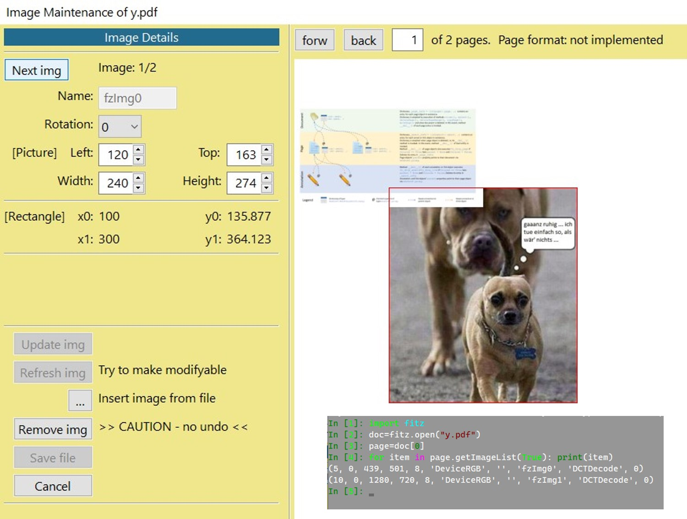

# Maintaining Images of a PDF Page
This is a GUI script written in wxPython to maintain the images shown by a PDF page.
## Main Features
* Detect images used by a page and display basic information: image reference name, location on the page ("bbox" - boundary box) and rotation.
* Multiple images can be selected one at a time by stepping through them via a button.
* The selected image can be deleted, moved around and rotated by multiples of 90 degrees.
* New images can be inserted from image files supported by MuPDF. They will be inserted at the page's top left and are then available for repositioning.

## General working approach
When a page is shown, the first image will be indicated by a red border (sequence determined by insertion sequence, FIFO). Use button **Next img** to select the desired one.

The mouse cursor hovering inside that area will change shape to indicate that moving is possible. Hold down left mouse button to drag.

The bottom right corner allows changing the area size. The mouse pointer changes its shape to a ➕ symbol.

While moving the rectangle, the image will stay at its current position. When you are satisfied with size, location and rotation, press button **_Update img_**. This causes the image to snap to the new area.

## Details
When starting the script, a file selection dialog is shown ('*.pdf' extensions only). After selecting the file, a dialog is shown with the file's first page displayed.

On the panel's left side a number of controls and information fields is shown:

* **Next img** - _(button)_ Step through the images. This is a wraparound button: after the last image, the first one will be shown again.
* **Image: 1/2** - _(information)_ Currently selected image (bordered red) and total number of images.
* **Name:** - _(information)_ The internal (PDF reference) name of the image. This is item[7] of the image's entry in `page.getImageList()` - shown in the picture for demo purposes.
* **Rotation** - _(ListBox)_ one of degrees 0, 90, 180, 270 - the (detected) image rotation. Can be updated.
* **[wx.Rect]** - _(information)_ The image coordinates on the screen (pixels), these are four **_SpinCtrl_** integer fields. Use them to change the image position or shape like with the mouse, but with a finer control.
* **[fitz.Rect]** - _(information)_ Followed by a number of text fields displaying the `fitz.Rect` that correspond to the **[wx.Rect]** coordinates.
* **Update img** - _(button)_ Becomes available once an image's coordinates or rotation have been changed. Clicking will update the image accordingly.
* **Refresh img** - _(button)_ Becomes available for images which are initially not modifyable. Clicking will re-code the PDF image invocation syntax. In many cases this may solve the problem.
* **[...]** - _(button)_ Opens a dialog to select an image file. The new image is inserted near the page's top-left corner and can then be positioned as desired.
* **Remove img** - _(button)_ Permanently removes the image from the page. This **cannot be undone**. The image itself is not removed from the file, so no other pages are affected that may be using it. If this page was indeed the only user, the image will be removed when saving to a new file.
* **Save file** - _(button)_ Becomes available with the first change. A file save dialog will be shown. If no new file is specified, an incremental update is done. Otherwise save to a new file with options `garbage=3, deflate=True` will happen. This will not end the script: you can continue. Later saves can be made to the same file or yet other new files. Every save will include all changes made since starting the script.
* **Cancel** - _(button)_ Immediately quit the dialog.

On the panel's right side the PDF page is displayed. In addition it contains the following information and controls:

* **forw** - _(button)_ Display next page.
* **back** - _(button)_ Display previous page.
* **[1]** - _(text field)_ Enter desired page number and press ENTER.
* More information to show the total number of pages and the current page format. The latter only works if the resp. module is available.

> Paging also works using the mouse wheel or the PageDown / PageUp keys.

The currently selected image is wrapped with a thin red border. Moving the cursor inside this area will change its appearance to a "hand" 👆 symbol and dragging the rectangle becomes available (left mouse button held down).

To change the rectangle shape or size, hover the mouse over the rectangle's bottom right corner until it changes to a cross ➕. Then drag with left mouse button held down.

These actions will move the red rectangle only. The image itself is not yet affected.

Pressing **Update img** moves the image to its new rectangle in the following way:

* The current aspect ratio (width : height) is maintained.
* The image is rotated as specified.
* The image is scaled to the maximum fitting size.
* Image center and rectangle center will be the same.
* The resulting image rectangle (which, as a result, is in general smaller) is wrapped again with a red border.

> If you do not press **Update img** before you leave the page or step to the next image, the current image will remain unchanged.

## Caveats and Limitations
Although many images can be handled with this script, there are situations that do not work or need some extra handling:

* In PDF, images may be referenced by a page directly (which we do handle), or indirectly via referencing a so-called **Form XObject**, which itself may contain images. The latter case is **not supported** and not included in this script's image list.
* Only images named in a page's `/Resources` object are supported - **no inline images**, **no PDF drawings**.
* The position of an image is determined by usually one PDF matrix command, which looks like `a b c d e f cm`. Letters **a** through **f** correspond to the same-named parameters of `fitz.Matrix`.  
But PDFs are a complex concept, and mostly there is a plethora of ways to achieve the same thing: occasionally multiple matrices may have been used, or the page may be subject to some coordinate system change, etc.
In those cases we only **_detect_** that the situation is not straightforward and do not offer changing the rectangle directly. The corresponding message is **"cannot re-compute image rect"**.
* Currently, PyMuPDF supports image rotations by multiples of 90° only. Other angles are not supported for modification. The message in this case is **"cannot handle image rotation"**.
* You can try to overcome the previous two cases by pressing **Refresh img**. The old image display command is deleted and a new, "clean" command is generated. The image will remain in its current position (but be displayed without rotation). This will mostly end up in a nice, now modifyable rectangle.  
But please do check the result and the well-being of  other images on the page!
