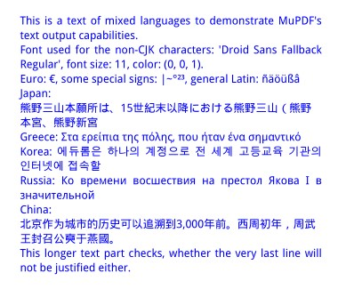

# Replacing Fonts in Existing PDFs using PyMuPDF

Using PyMuPDF v1.17.6 or later, replacing fonts in an existing PDF becomes possible. This describes a set of scripts which allow replacing selected fonts by some others.

## Features
It supports the following features:

* Replace selected or all fonts in a PDF.
* Ensure that all fonts in a PDF are embedded.
* Maintain the page layout, table of contents, links, images, etc.
* Build font subsets based on the characters used.

This makes it e.g. possible to replace **Courier** by a nicer monospaced font, or to take a non-serifed font instead of Times-Roman, etc.

## Technical Approach

* Each page is searched for text written with one of the replaceable fonts.
* These text pieces are inspected for their used unicodes.
* Build subsets for replacing fonts based on the used unicodes.
* Remove and rewrite each text span for a replaceable font.

The script makes heavy use of and is dependent on MuPDF's page cleaning and text extraction facilities, `Page.cleanContents()` and `Page.getText("dict")`.

## Choosing Replacement Fonts
The font replacing script expects a CSV file which specifies, which fonts should be replaced by which other fonts. You must execute a utility script which creates this list of all used fonts

Edit this file to specify which fonts you wish to change.

Here is an example output:

| fontname | replace | information |
|----------|-------------|-------------|
| Utopia-Regular-Identity-H | keep |  58 glyphs/size 7498/serifed |
| Utopia-Semibold-Identity-H | keep |  58 glyphs/size 8037/serifed/bold |
| Utopia-Italic-Identity-H | keep |  229 glyphs/size 5103/serifed |
| ZapfDingbats-Identity-H | keep |  2 glyphs/size 371/serifed |
| ArialMT-Identity-H | keep |  20 glyphs/size 2675/serifed |

Change the **"replace"** column value with a desired replacement font. If you want to keep the old font, ignore the line or delete it.

Use the "information" column to help make up your decision. If the old font has only a few used glyphs ("ZapfDingbats") and / or has a small size, you might want to leave it untouched. Other information like "bold", "mono", etc. may also help choosing the right replacement. Keep in mind however, that this latter information (provided by the font creator) cannot be garantied to be complete or even correct: you may see "serifed" although it is a "sans" font, or "mono" is missing even though it is a monospaced font, etc.

Use the following values to replace **"keep"** with a new font name:

* One of the Base-14 builtin fontnames Times-Roman, Helvetica, Courier, Symbol or ZapfDingbats and their font weight alternatives (like "heit" = Helvetica-Oblique).
* One of the CJK builtin fontnames, e.g. "china-t" for Traditional Chinese.
* One of the builtin fontnames for repositiory `pymupdf-fonts` fonts, e.g. "figo" for "FiraGO Regular", or "spacemo" for "Space Mono Regular".
* The file name of a font installed on your system, e.g. `C:/Windows/Fonts/DejaVuSerif-Bold.ttf`. In this case, make sure that the file name contains a "`.`" or a path separater ("`/`", "`\`") to be recognized as such.

## Limitations, TODOs, Quality Checks
While this is a set of cool scripts providing a long-awaited feature, it does have its limitations and shortcomings.

Among the general issues when replacing one font by another one are these:

1. You will probably **_see unsatisfactory results_** if you replace a mono-spaced by a proportional font, or vice versa.
2. Even if fonts have similar characteristics (e.g. both are proportional), there may exist subtle differences for select characters. This may lead to different text lengths even if font sizes are equal. Because the available space for a text piece must not be exceeded, the font size will be reduced to fit where needed - leading to an uneven overall appearance.
The contrary may also happen: if the new font is narrower, it will produce smaller text widths - which may lead to larger gaps to subsequent text pieces on the same line.
3. Do not expect that a justified text paragraph remains justified!
4. Make sure that the new font has all the required glyphs.


Existing text is extracted via `page.getText("dict")`. While this dictionary contains a lot of information about each text span, it is still not complete, e.g.

* There is currently no way to determine whether text is actually visible in the original. It may be covered by other objects like images (i.e. be in "background"), or be attributed as "hidden" - we wouldn't know this. **Rewritten text will always be visible.**
* There is currently no way to tell whether text is under control of some opacity (transparency) instruction. Rewritten text will have zero transparency. The only way to "simulate" this is via adapting this script to your needs. For illustration we have included logic that sets opacity to 20% if the font size is 100 or more.
* The precision of text extraction is critical for successful execution. On rare occasions, inter-character spacing may be incorrectly computed by MuPDF. Words may be erroneously joined or, vice versa characters in a word may show unexpected gaps. TODO: Maybe this can be healed by choosing the more detailed extraction method `page.getText("rawdict")` in a future version.
* Another important, heavily used MuPDF utility function is invoked by `Page.cleanContents()`. It concatenates multiple `/Contents` objects, purifies their command syntax and synchronizes the fonts actually **used,** with the fonts **listed** in the `/Resources` objects.
Again, on rare occasions, contents cleaning may damage page appearance. If this happens, it may help to replace all fonts.

## Notes on Font Subsetting
A font contains basically two things: (1) code that generates a character's visual appearance (the "glyph") and (2) a mapping between the character code and its glyph. In a simplistic view, a font can be thought of being a table which does this mapping.

Obviously, the larger the set of supported characters, the larger will be the size of a font. There are fonts which support many hundred or thousands of characters. For example "Droid Sans Fallback Regular" contains over 50,000 glyphs and has a file size of 3.6 MB.

On the other hand, for any given font in any given PDF, comparatively few of its glpyhs will **actually ever be used**. This used subset is often in the range of low two digit percentages, or even less. Getting rid of the unused font portions is therefore an important vehicle to control PDF file sizes.

This is what **_font subsetting_** is all about. We use package ``fontTools`` to do this for OTF and TTF font types.

``fontTools`` cannot create subsets for CFF type fonts (as far as we know).

To support embeddable versions of the old Base-14 fonts, MuPDF chooses CFF fonts: the "Nimbus" font families by URW++ - developped by URW Type Foundry GmbH). So if you choose one of these Base-14 replacement fonts, the resulting PDF may easily be larger than the original.

This is not necessarily a big problem: the Nimbus fonts are relatively small (around 50 KB or less per font weight). But you still may want to consider alternatives which support subsetting.

There also exist free versions of these Nimbus fonts **which are subsettable**, at [this](https://www.fontsquirrel.com/fonts/) website and search for nimbus-sans, nimbus-mono or nimbus-roman.

To illustrate the above, look at the following example numbers of a 4-page PDF, which was created as a PDF export of a Word document.

The original size is **240 KB** and it contains
* 63 glyphs sans-serif regular
* 34 glyphs sans-serif bold
* 24 glyphs mono-spaced bold
* 69 glyphs mono-spaced regular

Replacing these by (the non-subsettable) **"helv"** (33 KB), **"hebo"** (34 KB), **"cobo"** (51 KB) and **"cour"** (45 KB) Nimbus fonts, this leads to the new file size **172 KB**.

When instead taking **"Noto Sans Regular"**, **"Noto Sans Bold"**, **"Space Mono Bold"** and **"Space Mono Regular"** (which all support font subsetting), the resulting file size is only **53 KB** ... and it looks nicer!


## How to replace a font with itself
This may sound ridiculous. But imagine you have inserted text in a PDF using PyMuPDF and you are dissatisfied with the resulting file size: large-sized fonts were pulled in.

You can use this facility as a font subsetting mechanism and "replace" fonts with themselves.




The above multi language page had been created using the large font "Droid Sans Fallback Regular", which yielded a file size of **1.62 MB**. Applying the two scripts and replacing "keep" with "china-s" in the intermediate CSV file like so: ``"Droid Sans Fallback Regular;china-s; 50483 glyphs/size 3556308"`` yielded a new file size of only **16.1 KB**!

A very significant file size reduction in this case!

The run protocol looked like this:

```
python repl-font.py tw-textbox3.pdf
Processing PDF 'tw-textbox3.pdf' with 1 pages.

Phase 1: Create unicode subsets.
End of phase 1, 0.03 seconds.

Font replacement overview:
 Droid Sans Fallback Regular replaced by: Droid Sans Fallback Regular.

Building font subsets:
Used 179 glyphs of font 'Droid Sans Fallback Regular'. 3453 KB saved.
Font subsets built, 0.77 seconds.

Phase 2: rebuild document.
End of phase 2, 0.01 seconds
Total duration 0.81 seconds
```
> As you can see, although 5 different languages where used, it was only 180 glyphs out of over 50,000 in this font - about 0.36 percent. Consequently, most of this font was thrown out by subsetting.

## Changes
* Version 2020-09-02:
    - Now also supporting text in so-called "Form XObjects", i.e. text not encoded in the page's `/Contents`.
    - The intermediate CSV file containing mappings between old and new font names is now handled as a binary file (read / write options "rb", resp. "wb") to support fontnames encoded as general UTF-8.
