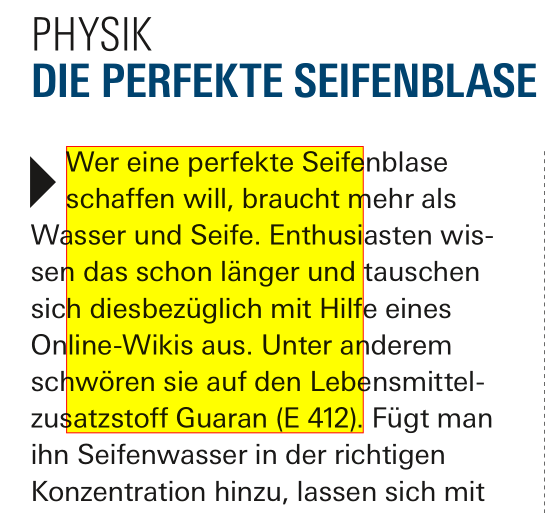

# Extracting Text from within a Rectangle
Extracting text from within specific rectangular areas of a document page is frequently required.

In PyMuPDF, you can select from several options to achieve this. All methods are applicable to all document types support by MuPDF - not only PDF. Choose the right method from the following list:

## 1. `Page.getTextbox(rect)`
Returns text contained in the rectangle 'rect'. Text appears in the sequence as coded in the document (which is not necessarily an appropriate reading sequence). Inclusion of text is decided by character. So words may appear mutilated. Line breaks may be contained, but one final line break will be omitted. See the example script `textbox-extract-2.py` in this folder.

----------

## 2. `Page.getText("text", clip=rect)`
This is one of the old, standard extraction methods - except for the `clip` parameter (if `None`, the full page is taken), which was introduced in version 1.17.7. The result looks like the previous method (which is actually derived from this one), except that there always is a final line break.

----------

## 3. `Page.getText("words")`
This is also an old, standard extraction method. The method delivers a list of items, which each represent one string without spaces (called a "word") - together with its position.

You have to write a script which selects the words contained in (or intersecting) the rectangle, sort the result (usually by vertical, then by horizontal coordinates) and then glue words together having the same bottom vertical coordinate.

The script `textbox-extract-1.py` is an example for such a script. It also implements two word selection alternatives: one with only accepting fully contained words, and a second one including any intersecting word.

This approach will guarantee intact original words and a reading sequence as established by your sort. However, any multiple spaces in the original text will be lost and replaced by one space.

----------

## Notes
This folder contains an example file `search.pdf` with one page and an annotation which shows the area to select from. The TOFU symbol in the outputs further down is show for the big black arrow whose character bbox intersects the selection rectangle.



### Output of `textbox-extract-1.py`
```
Select the words strictly contained in rectangle
------------------------------------------------
Wer eine perfekte
schaffen will, braucht
und Seife.
das schon länger und
diesbezüglich mit
aus. Unter
sie auf den
Guaran (E 412).

Select the words intersecting the rectangle
-------------------------------------------
Wer eine perfekte Seifenblase
schaffen will, braucht mehr

Wasser und Seife. Enthusiasten
sen das schon länger und tauschen
sich diesbezüglich mit Hilfe
Online-Wikis aus. Unter anderem
schwören sie auf den
Lebensmittel-
zusatzstoff Guaran (E 412).
```

### Output of `textbox-extract-2.py`
```

Wer eine perfekte Seife
schaffen will, braucht m
asser und Seife. Enthusia
n das schon länger und t
ch diesbezüglich mit Hilfe
nline-Wikis aus. Unter an
hwören sie auf den Lebe
satzstoff Guaran (E 412).
```
